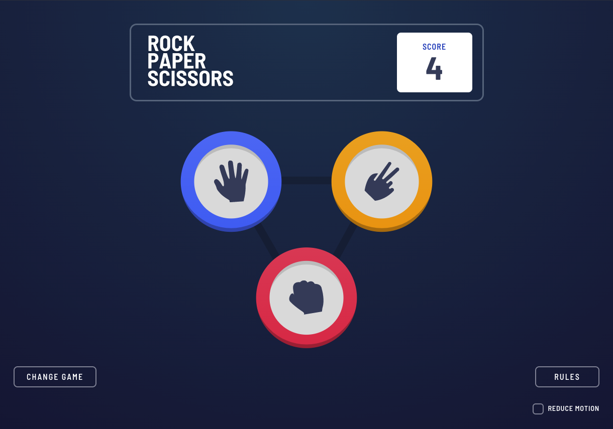
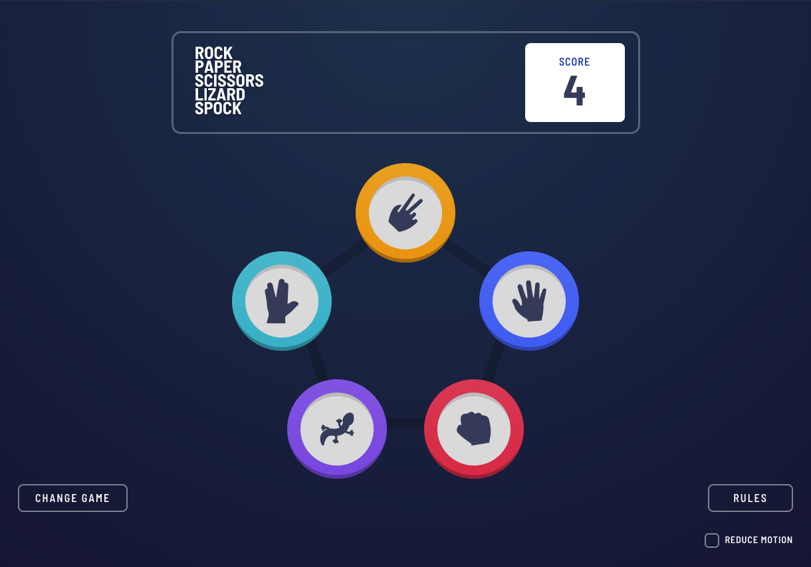

# Frontend Mentor - Rock, Paper, Scissors solution

This is a solution to the [Rock, Paper, Scissors challenge on Frontend Mentor](https://www.frontendmentor.io/challenges/rock-paper-scissors-game-pTgwgvgH). Frontend Mentor challenges help you improve your coding skills by building realistic projects. 

## Table of contents

- [Overview](#overview)
  - [The challenge](#the-challenge)
  - [Screenshot](#screenshot)
  - [Links](#links)
- [My process](#my-process)
  - [Built with](#built-with)
  - [What I learned](#what-i-learned)
  - [Continued development](#continued-development)
- [Author](#author)

## Overview

### The challenge

Users should be able to:

- View the optimal layout for the game depending on their device's screen size
- Play Rock, Paper, Scissors against the computer
- Play Rock, Paper, Scissors, Lizard, Spock against the computer
- Use keyboard only and/or screen readers to play (tested with OS X voice over)
- Maintain the state of the score after refreshing the browser
- Enable/disable a reduced motion setting for animations based on their OS system preferences or manual selection
- Maintain the state of their reduced motion preference

### Screenshots

#### Normal game

#### Bonus game

### Links

- Live Site URL: [Rock Paper Scissors Game](https://rock-paper-scissors-matthiassmith.vercel.app/)

## My process

### Built with

- Semantic HTML5 markup
- CSS Grid
- Mobile-first workflow
- [GSAP](https://greensock.com/) - For animations
- [React](https://reactjs.org/) - JS library
- [Styled Components](https://styled-components.com/) - For styles
- React hooks - State, Context, and Effect hooks

### What I learned

Building for accessibility takes thought and planning.
Especially for a game that includes animations and dynamic states.

I've been actively trying to become more aware of accessibility in my implementations. This challenge provided me with ample chance to familiarize myself with [Web Content Accessibility Guidelines (WCAG) 2.1](https://www.w3.org/TR/WCAG21/) and best practices. And I am on a never-ending journey to keep improving.

A few helpful resources that helped me with this are:
- [Accessibility Developer Guide](https://www.accessibility-developer-guide.com/)
- [A11y Style Guide](https://a11y-style-guide.com/style-guide/)
- [Designing With Reduced Motion For Motion Sensitivities](https://www.smashingmagazine.com/2020/09/design-reduced-motion-sensitivities/#top)

### Continued development

I would like to continue improving the experience overall. Getting feedback on the accessibility, and animations of the game could go a long way to making this a better project.

## Author

- Github - [Matthias Smith](https://github.com/MatthiasSmith)
- Frontend Mentor - [@MatthiasSmith](https://www.frontendmentor.io/profile/MatthiasSmith)